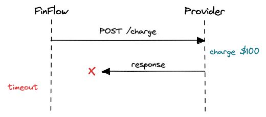

# Discovery 001 - Reliable Payment Orchestration

**Status:** Discovery
**Domain:** Payments
**Potential appetite:** 4 weeks
**Candidate service:** `payments-orchestrator`

## Context

Modern payment systems commonly integrate with external payment processors, acquiring platforms or payment service providers.

A merchant or financial platform cannot assume that these external systems are always available, fast or consistent.

A payment request may experience:
- network timeouts;
- processor outages;
- duplicated requests;
- duplicated webhooks;
- delayed responses;
- temporary errors;
- explicit declines;
- ambiguous outcomes.

The difficult problem is therefore not simply sending a payment request.

The difficult problem is determining **what actually happened to the money**.

## Core problem

Consider the following integration:




FinFlow is not able to know if the provider:
1. never received the operation;
2. received it but failed before processing;
3. successfully charged the customer but the response was lost.

Therefore:
```
timeout != payment failure
```

Blindly retrying the operation could cause a duplicate charge.

Treating this response as failed at some point will leave the platform's internal state inconsistent with the provider's state.

## Related problems

### Duplicate client requests
Clientes may retry requests because of:
- network failures;
- browser refreshes;
- mobile connectivity;
client-side timeout handling.

The platform must distinguish intentional new payments from retries of the same logical transaction/operation.

### Provider differences
Different providers exposse different:
- APIs;
- status models;
- error semantics;
- timeout behavior;
- retry recommendations.

The application shoud not leak these differences into its core payment model.

### Asynchronous updates
A provider may for example initially respond with `PROCESSING` and later publish `SUCCEEDED` through a webhook.

Te internal payment lifecycle therefore cannot assume that every operation completes synchronously.

### Duplicate notifications

External providers enerally operates under delivery semantics where notifications can be delivered more than once.

Processing the same notification twice st not mutate financial state twice.

## Key questions

The first shaping exercise should answer the following questions.

### Payment identity

How do we identify a logical payment?

Should the API require an idempotency key?

What is the scope and lifetime of that key?

### Payment state

What internal ayment states are required?

Possible candidates are:

```
CREATED
PROCESSING
SUCCEEDED
DECLINED
FAILED
UNKNOWN
```

Can transitions happen in any order?

Which transitions are irreversible?

### Ambiguous outcomes

What happens  the provider outcome not be determined?

Do we represent uncertainty explicitly?

Example:
```
PROCESSING
    │
 timeout
    ▼
UNKNOWN
```

How is that uncertainty eventually resolved?


## Provider abstraction

What is the minimum interface required for a payment provider?

Possible starting point?

```
authorize(payment)
get_payment(provider_payment_id)
```

Should retries belong to the provider adapter or orchestration layer?


## Persistence

What are the states we must persist?

Possible scenario:

```
Provider succeds
      ↓
Aplication crashes
      ↓
Database never records the success state
```

## Events

Which payment changes should eventually be exposed as domain events? 

Candidates:

```
payment.created
payment.processing
payment.succeeded
payment.declined
payment.failed
payment.requires_reconciliation
```

The events are identified during dicovery, however, an event broker is not automatically part f the first cycle.

## Failure scenarios to explore

The initial implementacion should be eventually able to simulate scenarios such as:

### Provider unavailable

```
request
   ↓
provider
   X
503
```

### `Timeout` before provider receives the request

```
request
   X
network
```

### `Timeout` after provider processes the request

```
request
   ↓
provider charges
   ↓
response
   X
```

### Duplicate API request

```
same idempotency key
        ↓
multiple HTTP requests
```

Expected property:

```
One logical payment
```

### Duplicate provider webhook

```
payment.succeeded
payment.succeeded
payment.succeeded
```

Expected property:
```
One state transition
```

## Financial correctness properties

Several properties should behave eventually as system invariants.

### No duplicate logical payment

A retry using the same idepotency identity must not independently execute the same payment multiple times.

### Explicit uncertainty

The system must not report a payment as failed solely because the communication with the provider failed.

### State transition integrity

Invalid payment state transitions must be rejected.

Example:
```
# BAD - should normally be impossible.
SUCCEEDED -> PROCESSING
```


### Traceability

It should be possible reconstruct why a payment reached the current state.

## What this project is not

The first implementation is not intended to become a real payment processor.

It will not:

- store debit/credit card data;
- handle PCI-sensitive information;
- connect to acquiring networks;
- move real money;
- implement a complete ledger;
- implement fraud detection;
- implement settlement;
- implement production authentication;
- support every payment method.

External processors will initially be simulated.

## Why this is a strong portfolio problem?

The project demonstrates engineering problems commonly hidden behind seemingly simple payment APIs:

- distributed uncertainty;
- idempotency;
- state machines;
- retries;
- provider abstractuin;
- transactional consistecy;
- eventual consistency;
- failure recovery;
- observability.

The value of the project is not the endpoint:
```
POST /payments
```

The value is defining what that endpoint mean when everything around fails.


## Learning alignment

### Python / FastAPI

- advanced API design;
- async I/O;
- dependency boundaries;
- Pydantic;
- structured error handling;
- testing.

### PostgreSQL

- transactions;
- constraints;
- locking;
- isolation levels;
- concurrency.

### Distributed systems

- retries
- idempotency;
- partial failure;
- consistency;
- messaging patterns.

### Software architecture

- hexagonal architecture;
- domain modeling;
- provider adapters;
- ADRs;
- contracts.

### System design

The project provides practical material for discussing:

- payment processing;
- high availability;
- idempotent APIs;
- failure recovery;
- external dependencies;
- event-driven architectures.

## Discovery exit criteria

Discovery is complete enough to move into shaping once we can answer:

1. What exact payment lifecycle will Cycle 1 support?
2. What failure scenarios are essential?
3. What guarantees will the API provide?
4. What functionality is deliberately excluded?
5. What is the smallest provider simulator that exposes the difficult cases?
6. What architectural uncertainties could treaten the four-week appetite?
